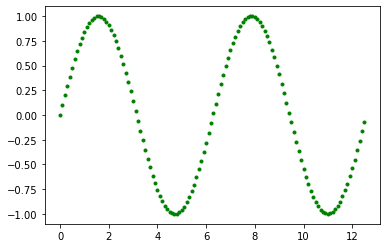
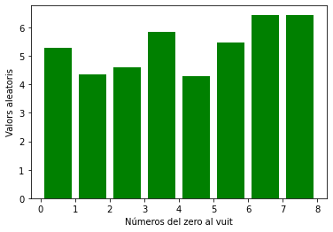
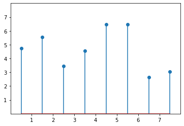
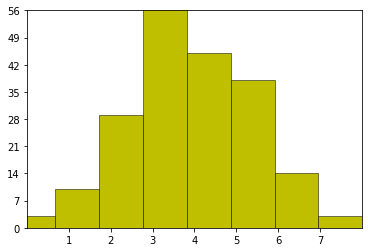
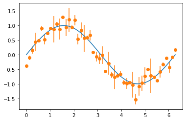
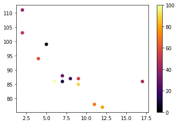
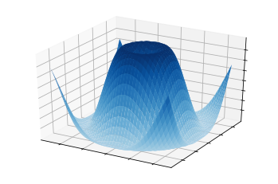
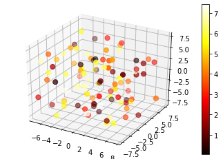
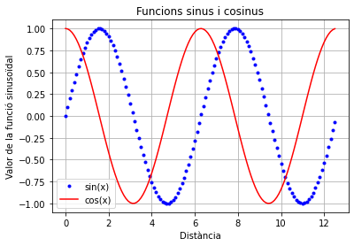

# **Gràfiques a Python**
{: .no_toc }

## Continguts
{: .no_toc .text-delta }

1. TOC
{:toc}
---

Primerament, importem el paquet que utilitzarem per fer les representacions gràfiques de les nostres dades, Matplotlib. Per raons de que sigui pràctic i per conveni d'altres programadors, s'abrevia amb plt. Si s'utilitza Jupyter notebook com a eina per córrer Python, només ficant la comanda ja s'ensenya el gràfic. Tot i això, en altres programes pot ser que calgui la comanda plt.show().
```js
import matplotlib.pyplot as plt
```
Per tal de córrer un gràfic cal tenir unes coordenades a dibuixar. En aquest cas, tindrem en compte la funció d'ona d'un orbital 3s de l'àtom d'hidrogen en base a la seva distància **r** (en *Bohrs*). Definirem una funció **f(r)** i diferents valors de radi entre 1 i 150. També calcularem el valor de f(r) per a cada r que hem definit. Per les constants i operacions matemàtiques s'utilitzarà el paquet **math**:

$$ y=sin(x) $$

```js
import math
import numpy as np

x = np.arange(0,4*np.pi,0.1)   # start,stop,step
y = np.sin(x)

```
El paquet **Numpy** és molt útil per a l'anàlisi de dades, però no és l'objectiu d'aquest capítol. Per tant, només cal que sapigueu que **np.arange** fa una llista de números entre 0 (primer terme, start) i 4pi (segon terme, stop) en intervals de 0.1 en 0.1 (tercer terme, step), i que serveix per cridar funcions matemàtiques com la funció sinus o la constant pi.


Un cop tenim les dades x i y que volem, és moment de representar-les. Per tal de fer-ho, utilitzarem **plt.plot()**.
```js
plt.plot(x,y)
plt.show()
```

Aquest és el vostre primer gràfic, enhorabona! Tot i això, no és gaire maco. Per modificar-lo, podem seguir amb alguns arguments com `marker`, `linestyle`, i `color`. L'argument `marker` representa el marcador que representa cadascuna de les dades que representem, `linestyle` representa la línia que uneix els punts i `color` representa el color amb el qual es representen les dades. Si a `linestyle` o a `marker` no hi ha cap paràmetre, no s'inclourà en el gràfic ni un a línia que uneixi els punts ni un marcador. A continuació us presentem alguns inputs que podeu ficar per modificar els gràfics com volgueu, però recordeu que al web https://matplotlib.org hi podeu trobar totes les opcions.

**Taula 1** Marcadors comuns a Matplotlib

| Argument | Descripció |
|:-------: | :--------:  |
| 'o'      |  cercle |
| '*'    | estrella |
| 'p'    | pentagon |
| '^'    | triangle |
| 's'    | quadrat   |


**Taula 2** Estils de línia comuns a Matplotlib

| Argument | Description |
|:-------: | :---------: |
|  '-'   | sòlid |
| '--'   | guió |
| '-.'   | guió-punt |
| ':'    | punts |

**Taula 3** Colors comuns a Matplotlib

| Argument | Description |
|:------: | :--------: |
| 'b' | blau |
| 'r' | vermell  |
| 'k' | negre |
| 'g' | verd |
| 'm' | magenta |
| 'c' | cian |
| 'y' | groc |


Per tal de ficar aquests arguments, la manera més fàcil és ficar-los tots com a un únic argument dins la funció. Així doncs, podrem fer servir **plt.plot(x,y,arg)**, on **arg** seran tots els arguments de caracterització del gràfic. Per exemple:
```js
plt.plot(x,y,'g.')
plt.show()
```

```js
plt.plot(x,y,'p-.y')
plt.show()
```

A més a més, podem superposar dos gràfics!
```js
z = np.cos(x)
plt.plot(x,y,'b.')
plt.plot(x,z,'r-')
plt.show()
```

Tenint dos conjunts de dades, hem de saber diferenciar què representa cada punt del gràfic. Primerament, podem marcar quines son les dades que estem tractant, és a dir, ficant una **label** a cada variable. Tanmateix, podem posar tant títol a cadascun dels eixos (**plt.xlabel()** i **plt.ylabel()**) com títol general a la figura(**plt.title()**). Tenint en compte les labels que hem atorgat a les variables, podem fer una llegenda automàtica per saber què és el que s'està representant al gràfic (**plt.legend()**). Per últim, podem ficar una graella perquè algunes de les dades es vegin millor, amb la comanda **plt.grid(True)**. Ficant tota aquesta informació, el gràfic pot quedar així:
```js
plt.plot(x,y,'b.', label='sin(x)')
plt.plot(x,z,'r-', label='cos(x)')
plt.xlabel('Distància')
plt.ylabel('Valor de la funció sinusoïdal')
plt.title('Funcions sinus i cosinus')
plt.grid(True)
plt.legend()
plt.show()
```

Recordem que aquestes son només algunes de les moltes opcions que dona **Matplotlib** per caracteritzar un gràfic! N'hi ha de moltes més que estan descrites al web https://matplotlib.org. 


Ara que hem vist a dibuixar un gràfic de punts i editar-lo de la manera que volem, anem a veure un recull de diferents gràfics que es poden utilitzar en el tractament de dades. Per a cadascun d'aquests gràfics la caracterització és molt similar a la que hem vist, tot i que algun gràfic pot tenir algun detall en específic.


### **GRÀFIC DE BARRES**
```js
x = 0.5 + np.arange(8)
y = np.random.uniform(2,7,len(x))
plt.xlabel('Números del zero al vuit')
plt.ylabel('Valors aleatoris')
plt.bar(x,y, color='green')
plt.show()
```

En aquest cas hem definit valors aleatoris d'alçada compresos entre 2 i 7 i hem definit 8 punts. El fet de que siguin aleatoris fa que cada vegada que es compili el codi s'obtingui un resultat diferent.


### **STEM PLOT**
```js
np.random.seed(3)
x = 0.5 + np.arange(8)
y = np.random.uniform(2, 7, len(x))

# plot
fig, ax = plt.subplots()

plt.stem(x, y)

ax.set(xlim=(0, 8), xticks=np.arange(1, 8),
       ylim=(0, 8), yticks=np.arange(1, 8))

plt.show()
```

En aquest cas, la comanda **ax.set()** fa que es defineixi millor el contacte de les barres verticals amb el terra del gràfic, és a dir, millora la posició dels punts del gràfic respecte els eixos. Podeu fer la prova de treure'l i veure com canvia el gràfic, és la millor forma d'aprendre! Es pot adaptar en la resta de gràfics, si s'escau, tot i que en aquest es nota més la diferència. També es poden treure els punts i més opcions de caracterització.


### **HISTOGRAMA**
```js
x = 4 + np.random.normal(0, 1.5, 200)
fig, ax = plt.subplots()

ax.hist(x, bins=8, linewidth=0.5, edgecolor="k", color='y')

ax.set(xlim=(0, 8), xticks=np.arange(1, 8),
       ylim=(0, 56), yticks=np.linspace(0, 56, 9))
plt.show()
```

En aquest cas, marquem els límits del gràfic perquè l'eix y arribi fins a 56 i l'eix x arribi a 8. També hem definit el color de la línia que separa les barres (negre) i el nombre de barres (bins) que tenim.


### **PIE CHART**
```js
x = [1, 2, 3, 4]
colors = plt.get_cmap('Blues')(np.linspace(0.2, 0.7, len(x)))

fig, ax = plt.subplots()
ax.pie(x, colors=colors, radius=3, center=(4, 4),
       wedgeprops={"linewidth": 1, "edgecolor": "white"}, frame=False)

ax.set(xlim=(0, 8),
       ylim=(0, 8))

plt.show()
```

En aquest tipus de gràfics podem definir cada porció amb un color diferent. Tot i això, per simplificar-nos la feina, **Matplotlib** té incorporades paletes de colors per ajudar-nos a escollir-los. És útil en gràfics en els quals el color pot aportar una informació (al següent gràfic es podrà veure més detalladament). Si fiquessim la comanda **frame=True** enlloc de **frame=False**, es veurien les línies del gràfic a sota i a l'esquerra. Per aquest gràfic no volem aquesta informació. A més, amb **ax.set** podem demanar que ens marqui les separacions de les línies del gràfic en cas de que en volguem.


### **MULTIPLE PLOT**
```js
err = np.random.normal(loc=0, scale=0.2, size=50) #definim el error dels punts de la gràfica sinus
err2 = np.random.normal(loc=0, scale=0.2, size=50) #definim la amplada de les barres de error

x = np.linspace(0,2*np.pi,50)
y = np.sin(x)

plt.plot(x,y)
plt.errorbar(x,y+err2,yerr=err, fmt='o')
plt.show()
```

En aquest exemple hem definit els errors com a valor aleatoris. En funció del tipus d'estudi que feu, tindreu ja definits els valors. La funció blava equival a la funció sinus sense modificar (el model teòric), els punts taronja equivaldrien als valors experimentals trobats i les barres d'error indicarien quant de lluny està el valor obtingut del valor teòric (en aquest cas, com que son valors aleatoris, no ho mostra).


### **HISTROGRAMA + PROBABILITAT**
```js
mu, sigma = 0, 0.1 #mitjana i desviació estàndard
s = np.random.normal(mu, sigma, 1000) #distribució normal de valors aleatoris

abs(mu - np.mean(s)) #comprovem la mitjana
abs(sigma - np.std(s, ddof=1)) #comprovem la desviació

count, bins, ignored = plt.hist(s, 30, density=True) #dibuixem el histograma
plt.plot(bins, 1/(sigma * np.sqrt(2 * np.pi)) *
               np.exp( - (bins - mu)**2 / (2 * sigma**2) ),
         linewidth=2, color='r') #dibuixem la desviació de una distribució normal
plt.show()
```


## **SCATTER PLOT**
```js
x = np.array([5,7,8,7,2,17,2,9,4,11,12,9,6])
y = np.array([99,86,87,88,111,86,103,87,94,78,77,85,86])
z = np.array([0, 10, 20, 30, 40, 45, 50, 55, 60, 70, 80, 90, 100])

plt.scatter(x, y, c=z, cmap='inferno')

plt.colorbar()

plt.show()
```

En aquest cas hem utilitzat un **cmap**, és a dir, una paleta de colors. A aquesta paleta se li poden assignar uns valors. Així doncs, cada punt de la gràfica donarà tres informacions: la de la posició x, la de la posició y i la de la intensitat del color respecte la barra de colors. Per a que es vegi a la figura, es pot utilitzar la comanda **plt.colorbar()**. Hi ha moltes paletes de colors diferents que es troben. La millor manera de trobar els colors més adients al treball és fer servir en una cel·la diferent la comanda **plt.colormaps()**, que ens donarà una llista de totes les opcions possibles, i a xafardejar! Si el que es vol és invertir l'ordre de les paletes (és a dir, que el color que per defecte marca el valor més baix sigui el que ara marca el valor més baix), caldrà afegir **_r** després de la paleta (per exemple, **cmap('Blues:r')**). Recordem també que no és estrictament necessari fer servir el colormap per aquest tipus de gràfic, sinó que amb la informació x i y dels punts ja és suficient per representar dades.


### **SURFACE PLOT 3D**
```js
from matplotlib import cm
X = np.arange(-5, 5, 0.25)
Y = np.arange(-5, 5, 0.25)
X, Y = np.meshgrid(X, Y)
R = np.sqrt(X**2 + Y**2)
Z = np.sin(R)

fig, ax = plt.subplots(subplot_kw={"projection": "3d"})
ax.plot_surface(X, Y, Z, vmin=Z.min() * 2, cmap=cm.Blues)

ax.set(xticklabels=[],
       yticklabels=[],
       zticklabels=[])

plt.show()
```

Una altra aplicació útil de la representació de dades és la representació en 3D, que tot i que durant el grau de Química no s'utilitzi, és una molt bona eina de visualització dels resultats obtinguts. El funcionament és similar, definició de 3 variables X, Y i Z (o amb els noms que trobeu més adients) i **ax.plot_surface()** per dibuixar el gràfic.


Un altre punt a comentar és que no cal importar tot el paquet matplotlib (o qualsevol altre) si només se n'utilitzarà una part. És per això que en aquest cas cridem la funció **cm** (de colormap) dins **matplotlib** (només haviem importat matplotlib.pyplot, és a dir, la llibreria de gràfiques dins matplotlib).


### **SCATTER PLOT 3D**
```js
import matplotlib.pyplot as plt
from mpl_toolkits.mplot3d import Axes3D
import numpy as np
i, j, k, l = (np.random.random((4,100))-0.5)*15
c = np.abs(l)

fig = plt.figure()
ax = fig.add_subplot(111, projection='3d')
cmhot = plt.get_cmap("hot")
cax = ax.scatter(i, j, k, l, s=50, c=c, cmap=cmhot)

plt.colorbar(mappable=cax)

plt.show()
```

En aquest gràfic som capaços de representar quatre tipus de dades diferents. NO és recomenable fer-ho ja que pot costar d'entendre, just l'efecte contrari del que es vol amb una gràfica. Tot i això, us mostrem un exemple perquè pot ser que en algun moment ho feu servir, i si més no perquè veieu quantes coses es poden fer amb aquest paquet. Cada punt aporta una coordenada x, y i z que codifica un valor en concret. A més, la intensitat del color dona el quart valor a cada punt. Una altra manera de representar les intensitats de colors és com es mostra a la gràfica de dalt, donant un valor aproximat de cada valor a cada intensitat diferent.


Ara hem vist diferents gràfics que es poden fer servir utilitzant Python. L'últim pas és descarregar aquestes imatges que hem creat. Tot i que la forma convencional de fer click dret i "Guardar la imatge" us pot semblar la manera més fàcil, pot perdre una mica de qualitat. Per això mateix existeix la comanda **plt.savefig()**, que permet guardar la figura allà mateix on estigueu treballant amb el codi (si esteu treballant amb el Google Colab, es guardarà a la finestra de l'esquerra. En aquesta comanda podeu afegir, entre d'altres, el nom i tipus del fitxer i la mida, per tal que es tingui la màxima resolució possible.
```js
x = np.arange(0,4*np.pi,0.1) 
y = np.sin(x)
z = np.cos(x)

plt.plot(x,y,'b.', label='sin(x)')
plt.plot(x,z,'r-', label='cos(x)')
plt.xlabel('Distància')
plt.ylabel('Valor de la funció sinusoïdal')
plt.title('Funcions sinus i cosinus')
plt.grid(True)
plt.legend()
plt.show()
plt.savefig('sinus_vs_cosinus', format='png')
```


## Per aprofundir
Com ja s'ha anat comentant al llarg del document, la pàgina web del matplotlib
és un lloc on poder buscar recursos i aprendre. Us animem a que busqueu més informació per vosaltres mateixos.
Aquí teniu links que poden ser d'interés:

1. Web Matplotlib. [https://matplotlib.org](https://matplotlib.org/)
2. Plantilles Matplotlib. [https://matplotlib.org/cheatsheets/](https://matplotlib.org/cheatsheets/)
3. Referècia de colors del Matplotlib [https://matplotlib.org/stable/gallery/color/colormap_reference.html](https://matplotlib.org/stable/gallery/color/colormap_reference.html)
4. Referències de marques del Matplotlib. [https://matplotlib.org/stable/api/markers_api.html](https://matplotlib.org/stable/api/markers_api.html)

<script type="text/javascript" src="//cdn.mathjax.org/mathjax/latest/MathJax.js?config=TeX-AMS-MML_HTMLorMML"></script>
<script type="text/x-mathjax-config">
    // Make responsive
    MathJax.Hub.Config({
    "HTML-CSS": { linebreaks: { automatic: true } },
    "SVG": { linebreaks: { automatic: true } },
    });
</script>
